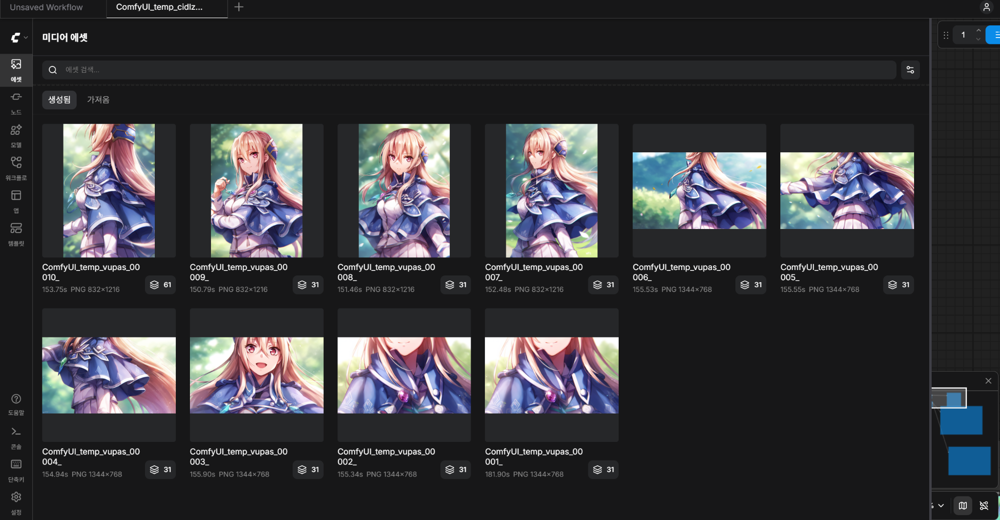
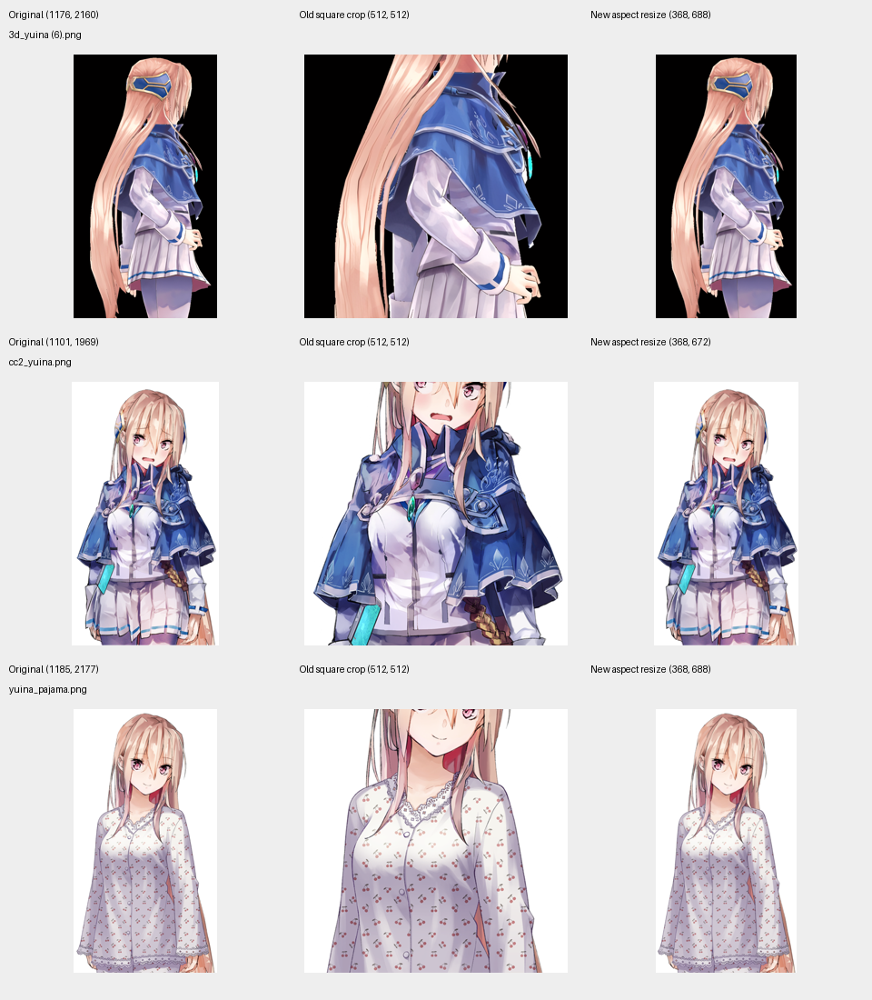
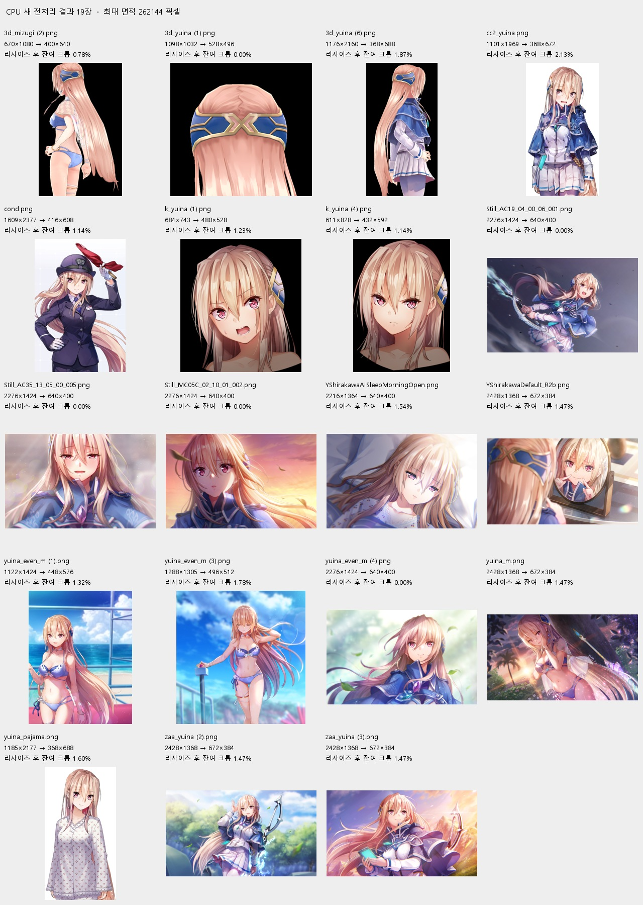

# LoRA 학습 이미지 전처리와 구도

## 문제

ComfyUI에서 LoRA를 적용해 생성할 때 머리·얼굴이 화면 밖으로 나가는 `out of frame` 구도가 반복됐다. 특히 1344×768 가로 출력에서 자주 나타났고, 부정 프롬프트에 `head out of frame`, `out of frame`을 강하게 넣어도 발생했다. 아래는 유이나 데이터셋으로 학습한 LoRA의 사례다.

## 원인

기존 전처리는 모든 이미지를 중앙 정사각형으로 잘라 512×512로 만들었다. 실제로 세로 원본의 머리·얼굴이 잘리고 몸통만 남는 학습 입력이 만들어졌다. 여기에 원본의 캐릭터 이름·머리색·의상·구도 캡션이 그대로 붙어, 해당 태그에 잘린 구도가 함께 학습될 가능성이 있다. 이 입력 손상이 반복된 `out of frame` 구도의 강한 원인 후보다.

## 변경

DiffSynth Anima 기본 예제처럼 원본 종횡비를 유지하며 `max_pixels` 면적 상한으로 축소하고, 가로·세로를 16의 배수로 맞춘다. 크기가 같은 이미지끼리 학습 배치를 구성한다. 데이터셋의 종류와 이미지 수에 관계없이 적용하는 방식이다.

왼쪽부터 **원본 → 기존 정사각형 크롭 → 변경한 전처리**다.

## 실제 전처리 결과

유이나 데이터셋 19장을 `max_pixels = 262144`로 CPU에서 처리한 결과다. 머리·얼굴과 원본 구도가 유지되며, 16픽셀 단위를 맞추는 잔여 크롭은 평균 **1.07%**, 최대 **2.13%**였다.

